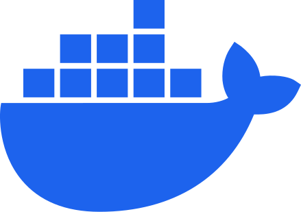

## Hey, I'm Max! 👋

### About me:
🔭 I’m currently working on: My personal website, where I'm exploring new design ideas and showcasing my projects.

🌱 I’m currently learning: Linux, diving into the world of open-source operating systems and server management.

👯 I’m looking to collaborate on: Although I've never collaborated before, I'm open to new opportunities and excited to work with others on interesting projects.

🤔 I’m looking for help with: Nothing specific at the moment, but I'm always open to learning from others and sharing knowledge.

💬 Ask me about: Anything you'd like! Whether it's web development, Linux, or anything else, I'm here to help.

⚡ Fun fact: I enjoy experimenting with different programming languages and technologies in my free time.

### my projects:
- [My personal website](https://max-hack.de) - My personal website, where I showcase my projects and share my thoughts on various topics.
- My cheatsheets - not public yet, but I'm planning to share my cheatsheets on various topics, such as web development, Linux, Docker, and more.
- My dotfiles - not public yet, but I'm planning to share my dotfiles, which I use to customize my Linux and macOS environment.
- this README - I'm planning to improve this README by adding more information and making it more visually appealing.

### future projects:
- url-shortener - A simple URL shortener, which I'm planning to build using Node.js, Express and MySQL, orchestrated with Docker compose.
- expense-tracker - A simple expense tracker, which I'm planning to build. I'm still deciding on the tech stack, but I'm considering learning React and most likely Node.js.

### my favorite tools and technologies

### my stats:
Please keep in mind, that these are only public repositories.  
_I'm of course still working on improving my GitHub stats._

---
© 2024 Maximilian Hack
